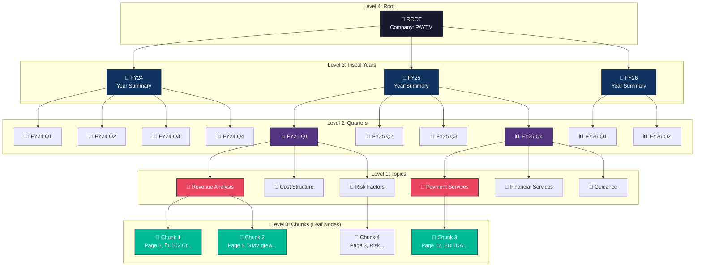
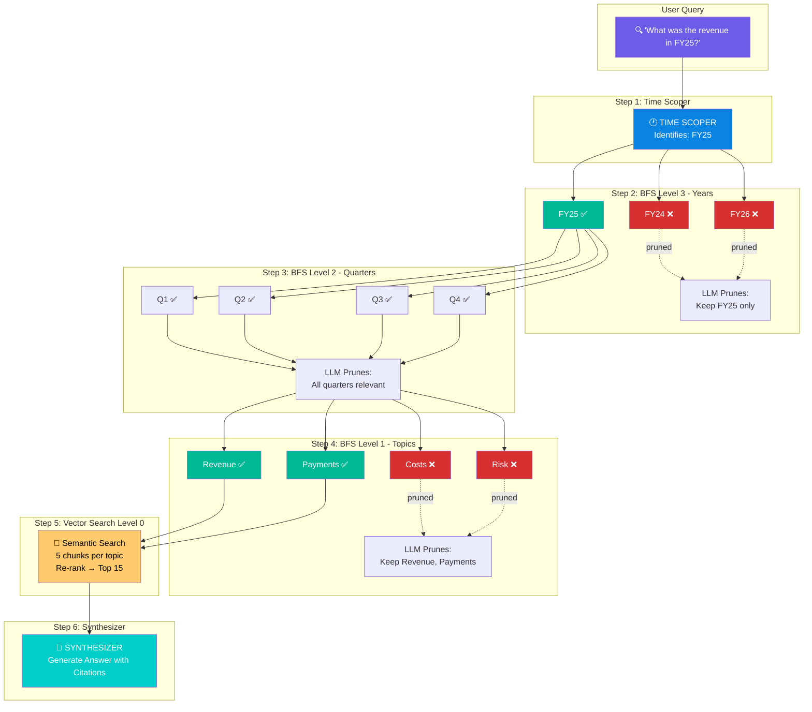
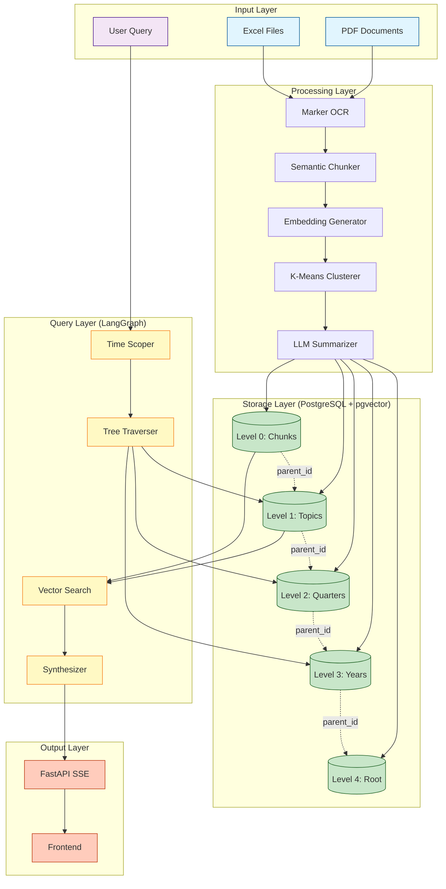

# FiscalFlow: Forensic Financial Analysis System

## 🎯 Project Overview

**FiscalFlow** is an advanced AI-powered forensic financial analysis system that enables intelligent querying of financial documents using a time-aware hierarchical RAG (Retrieval-Augmented Generation) architecture. The system processes financial transcripts, earnings reports, and Excel data into a multi-level semantic graph, enabling precise retrieval of information across different time periods.

### Key Features

- **Time-Aware Retrieval**: Automatically identifies relevant fiscal years and quarters from natural language queries
- **Hierarchical Data Structure**: 5-level tree architecture for efficient semantic search
- **LLM-Guided Pruning**: Intelligent BFS traversal with LLM-based node pruning to reduce search space
- **Balanced Topic Coverage**: Ensures diverse context by retrieving chunks from multiple topics
- **Provenance Tracking**: Complete metadata trail from original PDF pages to retrieved chunks
- **Streaming API**: Real-time query progress updates via Server-Sent Events (SSE)

---

## 🏗️ System Architecture

### Hierarchical Data Structure (5 Levels)

FiscalFlow organizes financial data in a tree hierarchy from company level down to individual text chunks:



#### Level Descriptions

| Level       | Name        | Description                             | Example                   |
| ----------- | ----------- | --------------------------------------- | ------------------------- |
| **Level 4** | Root        | Company-level narrative arc             | "PAYTM Narrative Arc"     |
| **Level 3** | Fiscal Year | Annual summary across all quarters      | "FY25 Yearly Narrative"   |
| **Level 2** | Quarter     | Quarterly overview across all topics    | "FY25 Q1 Overview"        |
| **Level 1** | Topic       | Semantic clusters (e.g., Revenue, Risk) | "Revenue Analysis"        |
| **Level 0** | Chunks      | Raw text blocks with embeddings         | "Page 5: Revenue grew..." |

---

## 🔍 Query Processing Flow

### LangGraph State Machine

FiscalFlow uses a **3-node LangGraph workflow** to process queries:



### Query Processing Stages

#### 1️⃣ Time Scoper (Node 1)

**Purpose**: Identifies relevant fiscal years from the user query

**Implementation**: [graph.py:L477-L557](file:///Users/consultadd/Desktop/Popcorn%20Hackathon/FiscalFlow/graph.py#L477-L557)

**Logic**:

- Explicit time references → Extract specific years (e.g., "FY25")
- Vague queries ("recent") → Last 2-3 years
- Historical queries → Last 4-5 years
- Also classifies query type: `DIRECT` (simple fact) vs `COMPLEX` (analysis required)

**Example**:

```python
Query: "What was the revenue in FY25 Q1?"
Output: target_years = ["FY25"], is_direct_query = True
```

#### 2️⃣ Tree Traverser (Node 2)

**Purpose**: Performs intelligent BFS tree walk with LLM-guided pruning

**Implementation**: [graph.py:L564-L667](file:///Users/consultadd/Desktop/Popcorn%20Hackathon/FiscalFlow/graph.py#L564-L667)

**Algorithm**:

1. **Fetch Level 3 (Year) nodes** matching target years
2. **LLM prunes** - Removes irrelevant years
3. **Fetch Level 2 (Quarter) children** of surviving years
4. **LLM prunes** - Removes irrelevant quarters
5. **Fetch Level 1 (Topic) children** of surviving quarters
6. **LLM prunes** - Removes irrelevant topics
7. **Vector search** - Retrieve chunks ONLY from surviving topics

**Key Innovation - Balanced Topic Coverage**:

- Retrieves `5 chunks per topic` (not global top-15)
- Combines all candidates into a pool
- Re-ranks by similarity → Returns top 15
- **Result**: Multiple topics represented in final context

**Fallback**:

- Direct queries → Skip tree walk, use global vector search (filtered to target years)
- All nodes pruned → Fallback to global search

#### 3️⃣ Synthesizer (Node 3)

**Purpose**: Generates forensic financial answer with citations

**Implementation**: [graph.py:L758-L813](file:///Users/consultadd/Desktop/Popcorn%20Hackathon/FiscalFlow/graph.py#L758-L813)

**Features**:

- Uses **GPT-4o** for high-quality analysis
- Includes provenance metadata (page numbers, fiscal periods)
- Citation format: `[Evidence 1] (FY25 Q1, Page 5): ...`
- Identifies trends and inconsistencies

---

## 📚 Core Components

### 1. Document Processor ([document_processor.py](file:///Users/consultadd/Desktop/Popcorn%20Hackathon/FiscalFlow/document_processor.py))

**Responsibilities**:

- PDF parsing with OCR (Marker + PDFPlumber fallback)
- Semantic chunking (500 chars, 50 char overlap)
- Embedding generation (OpenAI `text-embedding-3-small`)
- K-Means clustering for topic extraction
- LLM-based summarization for all hierarchy levels

#### Processing Pipeline


**Key Functions**:

| Function                        | Purpose                           | Lines                                                                                                        |
| ------------------------------- | --------------------------------- | ------------------------------------------------------------------------------------------------------------ |
| `parse_pdf_with_marker()`       | OCR extraction with page tracking | [L28-L134](file:///Users/consultadd/Desktop/Popcorn%20Hackathon/FiscalFlow/document_processor.py#L28-L134)   |
| `semantic_chunking()`           | Text chunking with provenance     | [L257-L301](file:///Users/consultadd/Desktop/Popcorn%20Hackathon/FiscalFlow/document_processor.py#L257-L301) |
| `generate_embeddings()`         | Batch embedding generation        | [L306-L327](file:///Users/consultadd/Desktop/Popcorn%20Hackathon/FiscalFlow/document_processor.py#L306-L327) |
| `cluster_chunks_semantically()` | K-Means topic clustering          | [L332-L363](file:///Users/consultadd/Desktop/Popcorn%20Hackathon/FiscalFlow/document_processor.py#L332-L363) |
| `summarize_cluster()`           | Topic node creation               | [L368-L421](file:///Users/consultadd/Desktop/Popcorn%20Hackathon/FiscalFlow/document_processor.py#L368-L421) |
| `build_hierarchy_layers()`      | L2/L3/L4 construction             | [L462-L618](file:///Users/consultadd/Desktop/Popcorn%20Hackathon/FiscalFlow/document_processor.py#L462-L618) |

### 2. Graph Query Engine ([graph.py](file:///Users/consultadd/Desktop/Popcorn%20Hackathon/FiscalFlow/graph.py))

**Responsibilities**:

- LangGraph state management
- Time-aware query routing
- BFS tree traversal with pruning
- Vector search with pgvector
- Answer synthesis

#### LangGraph State Schema

```python
class AgentState(TypedDict):
    query: str                          # Original user query
    target_years: List[str]             # Identified fiscal years
    target_quarters: List[str]          # Pruned quarters
    target_topics: List[Dict[str, Any]] # Surviving topic nodes
    retrieved_chunks: List[ChunkWithMetadata]  # Final context
    final_answer: str                   # Synthesized answer
    traversal_log: List[str]            # Debug trail
    is_direct_query: bool               # Query complexity flag
    company_ticker: Optional[str]       # Company filter
```

**Key Database Functions**:

| Function                         | SQL Operation                      | Lines                                                                                           |
| -------------------------------- | ---------------------------------- | ----------------------------------------------------------------------------------------------- |
| `get_nodes_by_level_and_years()` | Fetch nodes by level + year filter | [L129-L206](file:///Users/consultadd/Desktop/Popcorn%20Hackathon/FiscalFlow/graph.py#L129-L206) |
| `get_children_nodes()`           | Fetch children by parent IDs       | [L209-L273](file:///Users/consultadd/Desktop/Popcorn%20Hackathon/FiscalFlow/graph.py#L209-L273) |
| `vector_search_in_scope()`       | Per-topic vector search + re-rank  | [L276-L375](file:///Users/consultadd/Desktop/Popcorn%20Hackathon/FiscalFlow/graph.py#L276-L375) |
| `global_vector_search()`         | Fallback global semantic search    | [L379-L470](file:///Users/consultadd/Desktop/Popcorn%20Hackathon/FiscalFlow/graph.py#L379-L470) |

### 3. Database Models ([models.py](file:///Users/consultadd/Desktop/Popcorn%20Hackathon/FiscalFlow/models.py))

**Primary Table**: `nodes`

```python
class Node(Base):
    node_id: UUID                    # Primary key
    parent_node_id: UUID             # Tree relationship
    level_depth: int                 # 0-4 (Chunk to Root)
    text_content: Text               # Content/summary
    embedding: Vector(1536)          # Semantic vector
    company_ticker: str              # Company filter
    fiscal_year: str                 # Time filter
    fiscal_quarter: str              # Quarter filter (nullable)
    topic: str                       # Topic name (L1 only)
    node_metadata: JSONB             # Provenance, child IDs, etc.
```

**Optimization Indexes**:

1. **HNSW Vector Index** - Fast cosine similarity search

   ```sql
   CREATE INDEX idx_nodes_embedding ON nodes USING hnsw (embedding vector_cosine_ops)
   WITH (m = 16, ef_construction = 64);
   ```

2. **Composite Filter Index** - Time-slice queries

   ```sql
   CREATE INDEX idx_nodes_filters ON nodes
   (company_ticker, fiscal_year, fiscal_quarter, level_depth);
   ```

3. **GIN Metadata Index** - JSON search
   ```sql
   CREATE INDEX idx_nodes_metadata ON nodes USING gin (node_metadata);
   ```

### 4. FastAPI Backend ([api.py](file:///Users/consultadd/Desktop/Popcorn%20Hackathon/FiscalFlow/api.py))

**Endpoints**:

| Endpoint        | Method | Description                                |
| --------------- | ------ | ------------------------------------------ |
| `/query/stream` | POST   | SSE streaming query (real-time progress)   |
| `/query`        | POST   | Synchronous query                          |
| `/upload`       | POST   | Document upload with background processing |
| `/health`       | GET    | Health check                               |

**SSE Event Types**:

```javascript
// Status updates
event: status
data: {"stage": "time_scoping", "message": "Identifying years..."}

// Retrieved sources (one per topic)
event: source
data: {"evidence_id": 1, "text_content": "...", "provenance": {...}}

// Final answer
event: answer
data: {"content": "Revenue in FY25 was...", "timestamp": "..."}

// Completion metadata
event: complete
data: {"chunks_retrieved": 15, "traversal_log": [...]}
```

---

## 🛠️ Technology Stack

### Core Technologies

| Layer               | Technology                      | Purpose                          |
| ------------------- | ------------------------------- | -------------------------------- |
| **Database**        | PostgreSQL + pgvector           | Vector storage & semantic search |
| **ORM**             | SQLAlchemy (async)              | Database interactions            |
| **OCR**             | Marker + PDFPlumber             | PDF text extraction              |
| **Embeddings**      | OpenAI `text-embedding-3-small` | 1536-dim vectors                 |
| **LLM (Pruning)**   | GPT-4o-mini                     | Fast, cost-effective pruning     |
| **LLM (Synthesis)** | GPT-4o                          | High-quality analysis            |
| **Workflow**        | LangGraph                       | State machine orchestration      |
| **API**             | FastAPI                         | REST + SSE endpoints             |
| **Clustering**      | scikit-learn K-Means            | Topic extraction                 |

### Python Dependencies

Key packages from [requirements.txt](file:///Users/consultadd/Desktop/Popcorn%20Hackathon/FiscalFlow/requirements.txt):

```
fastapi==0.115.6
uvicorn==0.34.0
sqlalchemy==2.0.36
asyncpg==0.30.0
pgvector==0.3.6
openai==1.59.6
langchain-openai==0.2.14
langgraph==0.2.64
marker-pdf==1.3.4
pdfplumber==0.11.4
scikit-learn==1.6.1
numpy==2.2.2
```

---

## 📊 Data Flow Diagram

### Complete System Overview



---

## 🧪 Usage Examples

### Document Processing

```bash
# Single document
python document_processor.py documents/PAYTM/FY25/Q1/earnings_call.pdf

# Batch processing
python batch_process.py
```

### Query Execution

```bash
# CLI
python graph.py "What was the revenue growth in FY25?"

# API (Streaming)
curl -X POST http://localhost:8000/query/stream \
  -H "Content-Type: application/json" \
  -d '{
    "username": "analyst01",
    "query": "Analyze payment services revenue in FY25",
    "company_ticker": "PAYTM"
  }'
```

### Sample Query Output

```json
{
  "query": "What was the revenue in FY25 Q1?",
  "answer": "According to [Evidence 1] (FY25 Q1, Page 5), the revenue for FY25 Q1 was ₹1,502 Cr, representing a 32% year-over-year growth...",
  "target_years": ["FY25"],
  "chunks_retrieved": 15,
  "sources": [
    {
      "evidence_id": 1,
      "text_content": "Revenue for Q1 FY25 stood at ₹1,502 Cr...",
      "similarity": 0.89,
      "fiscal_year": "FY25",
      "fiscal_quarter": "Q1",
      "provenance": {
        "page_label": "5",
        "file_name": "earnings_call.pdf",
        "bbox": [100, 200, 500, 300]
      }
    }
  ]
}
```

---

## 🎯 Key Algorithms & Innovations

### 1. Balanced Topic Coverage

**Problem**: Global top-K vector search can exclude entire topics if another topic has highly similar chunks.

**Solution**: Per-topic retrieval + re-ranking

```python
# Retrieve 5 chunks from EACH topic
for topic_id in surviving_topics:
    chunks = vector_search(query, parent_id=topic_id, limit=5)
    candidates.extend(chunks)

# Re-rank combined pool and take top 15
candidates.sort(key=lambda x: x.similarity, reverse=True)
final_chunks = candidates[:15]
```

**Result**: Multiple perspectives in context, better synthesis quality.

### 2. LLM-Guided Pruning

**Problem**: Searching all 100+ topics wastes compute and retrieves noise.

**Solution**: BFS with LLM filtering at each level

```python
Candidate nodes at L3: [FY23, FY24, FY25, FY26]
↓ LLM Prune (GPT-4o-mini analyzes query + node summaries)
Surviving nodes: [FY24, FY25]
↓ Fetch children (L2)
Candidate nodes at L2: [Q1, Q2, Q3, Q4] × 2 years = 8 nodes
↓ LLM Prune
Surviving nodes: [FY24 Q4, FY25 Q1, FY25 Q2]
↓ Fetch children (L1)
Candidate nodes at L1: ~30 topics across 3 quarters
↓ LLM Prune
Surviving nodes: [Revenue Analysis, Payment Services, Financial Guidance]
↓ Vector search (only in these 3 topics)
Final: 15 chunks from 3 topics
```

**Efficiency**: Reduces search space from 1000+ chunks to ~50 candidates before vector search.

### 3. Hybrid OCR Parser

**Challenge**: Financial PDFs often have complex layouts, tables, and scanned images.

**Solution**: Multi-fallback parsing strategy

```python
1. Try: Marker (ML-based OCR) with block structure traversal
2. Fallback 1: Marker + page delimiter splitting
3. Fallback 2: PDFPlumber page boundaries + Marker OCR text
4. Fallback 3: Estimated page breaks (3000 chars/page)
```

**Result**: Maintains page-level accuracy even when structure parsing fails.

---

## 📁 Project Structure

```
FiscalFlow/
├── api.py                    # FastAPI backend with SSE streaming
├── graph.py                  # LangGraph query engine
├── document_processor.py     # PDF processing pipeline
├── excel_processor.py        # Excel data ingestion
├── batch_process.py          # Batch document processing
├── models.py                 # SQLAlchemy Node model
├── database.py               # Database configuration
├── schema.py                 # Pydantic schemas
├── requirements.txt          # Python dependencies
├── docker-compose.yml        # PostgreSQL + pgvector setup
├── documents/                # Document storage
│   └── {COMPANY}/{YEAR}/{QUARTER}/*.pdf
└── README.md                 # Setup instructions
```

---

## 🚀 Getting Started

### Prerequisites

- Python 3.10+
- PostgreSQL 15+ with pgvector extension
- OpenAI API key

### Installation

```bash
# Clone repository
git clone <repository-url>
cd FiscalFlow

# Install dependencies
pip install -r requirements.txt

# Setup PostgreSQL with pgvector
docker-compose up -d

# Initialize database
python init_db.py

# Configure environment
cp .env.example .env
# Add OPENAI_API_KEY to .env
```

### Running the System

```bash
# Start API server
uvicorn api:app --reload --port 8000

# Process documents
python batch_process.py

# Run queries
python graph.py "Your question here"
```

---

## 🔐 Security & Performance

### Database Optimization

- **HNSW Index**: Sub-second vector search on 10K+ nodes
- **Composite Indexes**: Fast time-slice filtering
- **Connection Pooling**: AsyncSessionLocal for concurrency

### LLM Cost Optimization

- **GPT-4o-mini** for pruning (10x cheaper than GPT-4o)
- **GPT-4o** only for final synthesis
- **Batch embeddings**: 1 API call for all chunks per document

### Provenance Tracking

Every chunk includes:

- Original PDF filename
- Page number
- Bounding box coordinates
- Character offsets
- Fiscal period metadata

---

## 📈 Future Enhancements

- [ ] Multi-company comparison queries
- [ ] Chart/table extraction and analysis
- [ ] Temporal trend visualization
- [ ] Fine-tuned embedding model for financial domain
- [ ] Graph-based entity linking across documents
- [ ] Automated anomaly detection

---

## 📝 License & Credits

**Built with**:

- LangChain & LangGraph for orchestration
- OpenAI for embeddings & LLMs
- PostgreSQL & pgvector for semantic storage
- Marker & PDFPlumber for OCR

**Created for**: Popcorn Hackathon 2026
